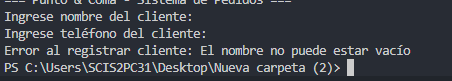
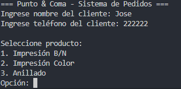
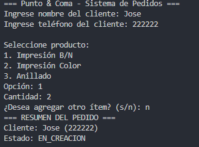
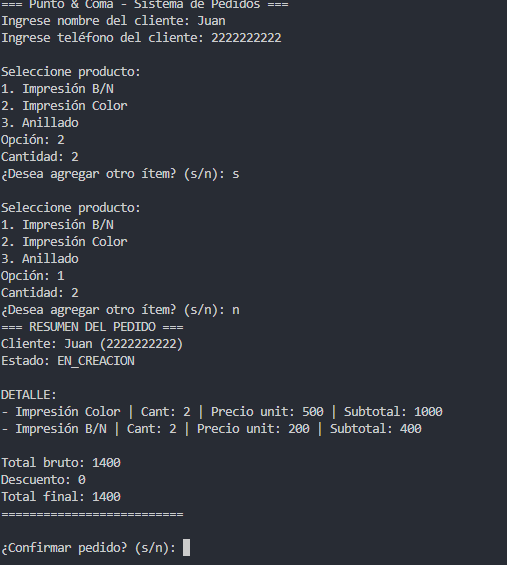
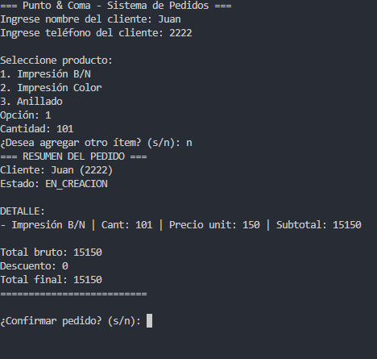
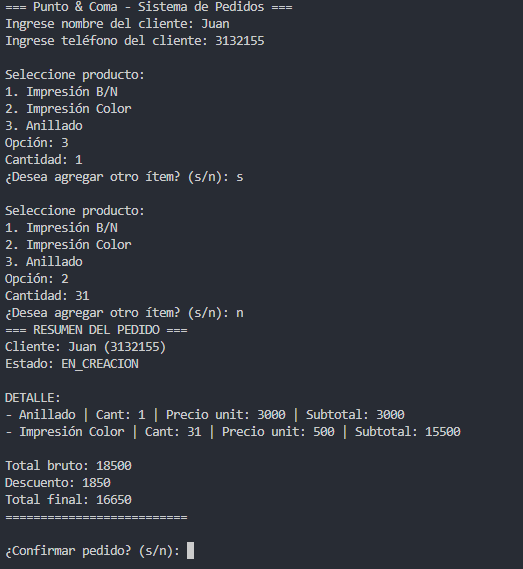
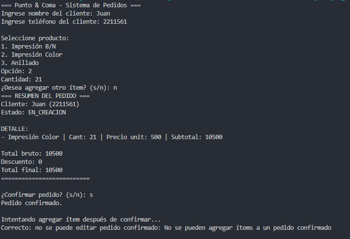
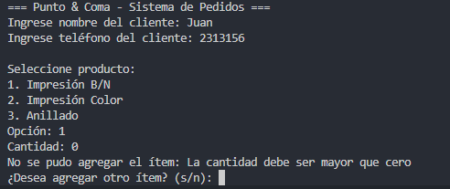
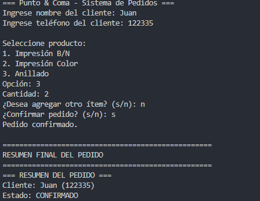
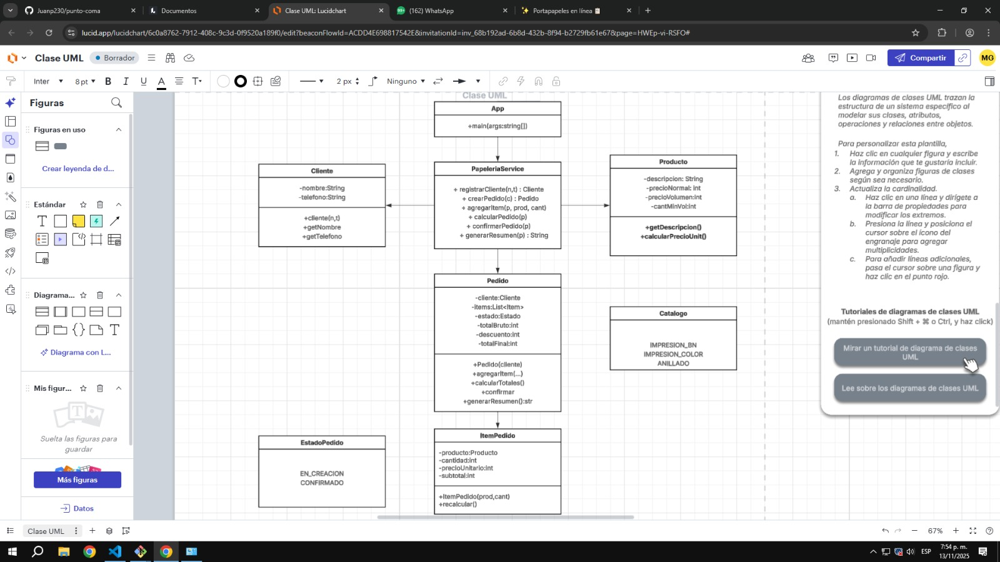

# Papelería “Punto & Coma”

En Punto & Coma, estudiantes e independientes hacen encargos de impresión y anillado para recoger el mismo día. El sistema registra nombre y teléfono del cliente y permite crear un pedido con ítems de este catálogo: Impresión B/N ($200 c/u, o $150 c/u si son 100 o más), Impresión Color ($500 c/u, o $400 c/u si son 50 o más), y Anillado ($3.000 c/u, sin precio por volumen). El cálculo funciona así: primero determinar subtotales por ítem aplicando precio por volumen cuando corresponda; luego sumar el total bruto; después aplicar un solo beneficio: si el pedido incluye al menos un anillado y la suma de impresiones (B/N + Color) es ≥ 30, se aplica 10% de descuento; de lo contrario, si el total bruto > $40.000, aplicar 5% de descuento; si ninguna condición se cumple, no hay descuento. No se aceptan cantidades ≤ 0. Tras confirmar el pedido, queda bloqueado y el sistema debe mostrar un resumen con detalle (precio aplicado por ítem), total bruto, descuento y total final. No se gestiona inventario ni pagos: solo el flujo de crear → calcular → confirmar → resumir.

1.REQUERIMIENTOS FUNCIONALES
RF1. Registrar al cliente (nombre, teléfono).
RF2. agregar ITEM al pedido(producto cantidad)
RF3. Usar precio por volumen si la cantidad de Impresión B/N ≥ 100 o Impresión Color ≥ 50.
RF4. crear estado del pedido (en creacion ,confirmado ) 
RF5. Calcular total (Si incluye al menos un anillado y la suma de impresiones (B/N + Color) ≥ 30 → 10% de descuento.
- Si el total bruto > $40.000 → 5% de descuento.
- En caso contrario → sin descuento.)
RF6. CONFIRMAR pedido (cambia de en creacion a CONFIRMADO-no se puede editar )
RF7. validar cantidades ( < a 0 y totales que no sean negativos)
RF8.Listar resumen: cabecera (cliente y estado), detalle (precio normal o por volumen), subtotales, descuento y total final.

2. criterios de aceptacion 
CA1

Dado que el usuario ingresa los datos del cliente
Cuando el nombre o el teléfono están vacíos
Entonces el sistema no permite continuar.

Dado que el usuario ingresa nombre y teléfono válidos
Cuando confirma el registro
Entonces el cliente se almacena correctamente.

CA2

Dado un cliente válido
Cuando se crea un nuevo pedido
Entonces el pedido inicia en estado EN_CREACION.

CA3

Dado un pedido en estado EN_CREACION
Cuando el usuario agrega uno o varios ítems con cantidades válidas
Entonces los ítems se agregan correctamente.

CA4

Dado que se solicitan 100 o más impresiones B/N
Cuando se calcula el precio unitario
Entonces el precio es $150.

Dado que se solicitan menos de 100 impresiones B/N
Cuando se calcula el precio unitario
Entonces el precio es $200.

Dado que se solicitan 50 o más impresiones a color
Cuando se calcula el precio unitario
Entonces el precio es $400.

Dado que se solicitan menos de 50 impresiones a color
Cuando se calcula el precio unitario
Entonces el precio es $500.

CA5

Dado un pedido con al menos un anillado y 30 o más impresiones
Cuando se calcula el total
Entonces se aplica un descuento del 10%.

Dado un pedido sin anillado o con menos de 30 impresiones y total bruto mayor a $40.000
Cuando se calcula el total
Entonces se aplica un descuento del 5%.

Dado un pedido que no cumple ninguna condición de descuento
Cuando se calcula el total
Entonces no se aplica descuento.

CA6

Dado un pedido en estado EN_CREACION
Cuando el usuario confirma el pedido
Entonces el estado pasa a CONFIRMADO y no se puede modificar.

CA7

Dado que el usuario intenta agregar un ítem con cantidad menor o igual a 0
Cuando el sistema valida ese ítem
Entonces se rechaza y se muestra error.

CA8

Dado un pedido válido con cálculo realizado
Cuando el usuario solicita el resumen
Entonces se muestran cliente, ítems, precio unitario, subtotal, total bruto, descuento y total final.

3. REGLAS 
RN1	Todo pedido debe estar asociado a un cliente con nombre y teléfono válidos.
RN2	Un pedido solo puede tener dos estados: EN_CREACION y CONFIRMADO.
RN3	Las cantidades de productos deben ser mayores que cero; no se permiten valores negativos o nulos.
RN4	Los precios de los productos son fijos y pertenecen al siguiente catálogo:
 • Impresión Blanco y Negro: $200 c/u (o $150 c/u si son ≥ 100).
 • Impresión Color: $500 c/u (o $400 c/u si son ≥ 50).
 • Anillado: $3.000 c/u (sin precio por volumen).
RN5	El sistema debe calcular los subtotales por cada ítem aplicando el precio por volumen solo si se cumple la cantidad mínima definida.
RN6	El total bruto es la suma de todos los subtotales antes de aplicar cualquier descuento.
RN7	Solo se puede aplicar un descuento por pedido, según estas condiciones de prioridad:
 1 Si el pedido incluye al menos un anillado y la suma de impresiones (B/N + Color) ≥ 30 → 10% de descuento.
 2 En caso contrario, si el total bruto > $40.000 → 5% de descuento.
 3 Si ninguna se cumple → sin descuento.
RN8	El total final del pedido se obtiene restando el descuento al total bruto.
RN9	Una vez que un pedido es confirmado, no puede ser editado, modificado ni eliminado.
RN10 El sistema no maneja inventario ni pagos; su alcance se limita al registro, cálculo y confirmación de pedidos.
RN11	El flujo es: Registrar cliente → Crear pedido → Agregar ítems → Calcular → Confirmar → Resumir.

4. pruebas
CA1: 
CA1.2: 
CA2: 
CA3: 
CA4: 
CA5: 
CA6: 
CA7: 
CA8: 

5. arquitectura 
/punto-coma/
├─bin/
├─assets/
├─src/
├    ├─ domain/
│    │   ├─ Cliente.java
│    │   ├─ Producto.java        // catálogo: BN, COLOR, ANILLADO
│    │   ├─ ItemPedido.java
│    │   ├─ Pedido.java
│    │   └─ EstadoPedido.java    // EN_CREACION, CONFIRMADO
│    ├─ service/
│    │   └─ PapeleriaService.java
└─ app/
    └─ App.java             // main con flujo de consola

    UML
    

    
